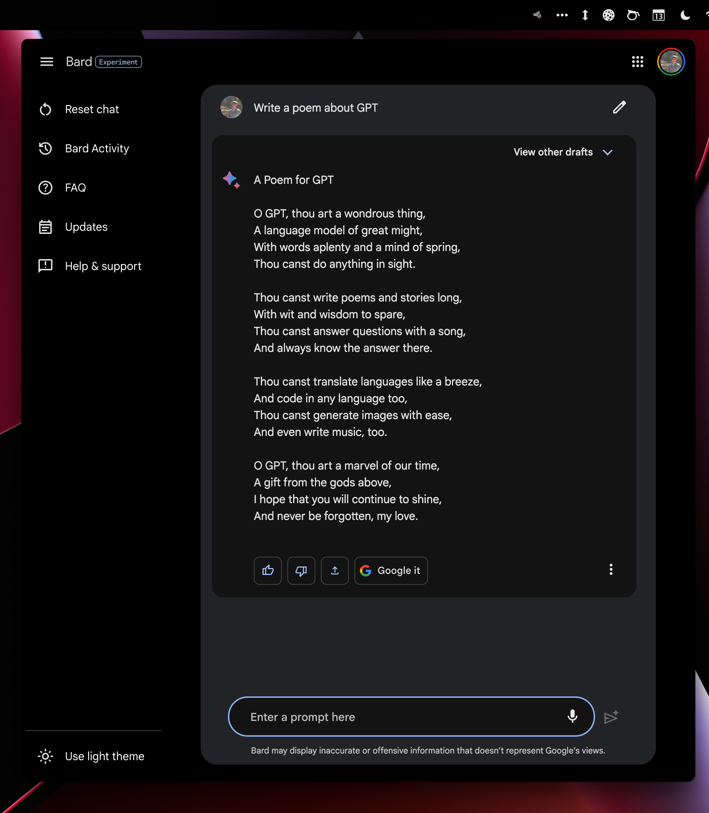

# BardGPT for desktop

This is a simple app that makes BardGPT live in your menubar.

You can use Cmd+Shift+G (Mac) or Ctrl+Shift+G (Win) to quickly open it from anywhere.

Download:

- Mac:  Apple Silicon/Arm64 Installer - [Mac Arm64 .dmg]()
- Mac: Intel Installer - [Mac Intel .dmg]()

No Windows binaries currently offered. Clone the repo, npm install electron-forge and run.

  

## Credit
- Huge thanks to [@vincelwt](https://github.com/vincelwt) for [chatgpt-mac](https://github.com/vincelwt/chatgpt-mac) based on which this is built.
- All credit and copyrights goes to Google.

## Author

You can find me on Twitter [@ShadowfaxApp](https://twitter.com/ShadowfaxApp).
